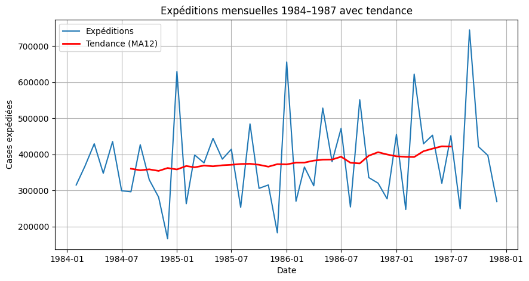

# Harmon Foods Sales Forecasting

This project analyzes monthly cereal shipments from Harmon Foods and builds forecasting models to predict future shipments.

## Objectives

- Analyze monthly shipment trends
- Identify seasonality effects
- Study the impact of promotional activities
- Build regression-based forecasting models
- Forecast shipments for 1988

## Methods Used

- Time series analysis
- Moving average trend analysis
- Seasonality analysis
- Lag variables
- Multiple linear regression
- Forecast evaluation

## Project Structure

```text
harmon-foods-forecasting/
├── data/
├── notebooks/
├── results/
└── README.md
```


## Trend Visualization


